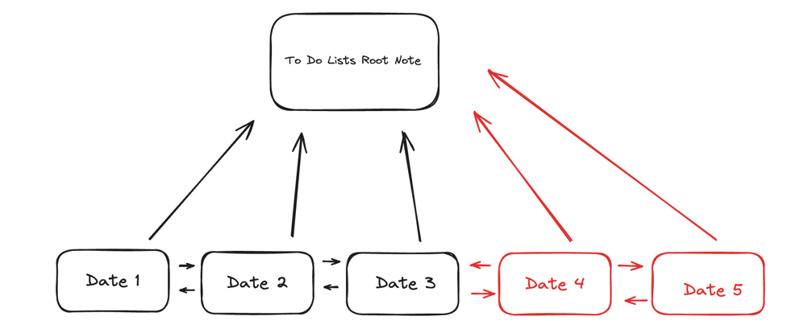

# Program Purpose
- The purpose of this program is to generate a set of dated to do list markdown files to add to an existing set of the same type of files.
- Specifically, it is designed to create to do list markdown files that come after a certain date (each date will have its own to do list markdown file)
- It is not meant to create an independent set of to do list markdown files
- Ex: 
- Using this diagram as a reference, the program is meant to generate the Date 4 and Date 5 to do lists. It relies on previous dates (e.g., Date 1, Date 2, and Date 3) already existing.
# Additional Notes
- This program currently isn't user-friendly
- Just made this for practical use, might add some user-friendly functionality in the future such as a main menu